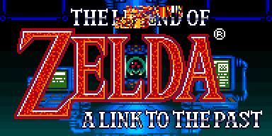

# SMZ3 Quality of Life Patches
Some quality of life patches ported from VARIA randomizer for SMZ3.

### Important Info
- The IPS files are the only thing you need to download, you'll have to apply them individually with something like LunarIPS.
- Text documents show how the addresses have been adjusted for SMZ3.

### Patches
[**Elevators Speed**](VARIA%20Patches/elevators_speed_smz3.ips "elevators_speed_smz3.ips") (original developed by Lioran)
- increases elevator speed in the Super Metroid side

[**Fast Doors**](VARIA%20Patches/fast_doors_smz3.ips "fast_doors_smz3.ips") (original developed by Rakki)
- increases door transition speed in the Super Metroid side

[**Infinite Space Jump**](VARIA%20Patches/Infinite_Space_Jump_smz3.ips "Infinite_Space_Jump_smz3.ips") (original developed by MetConst)
- removes all limitation of Space Jump so it may be spammed freely
	
[**Spin Jump Restart**](VARIA%20Patches/spinjumprestart_smz3.ips "spinjumprestart_smz3.ips") (original developed by Kejardon)
- allows pressing jump to begin spinning during a non-spinning jump 

[**Refill Before Save**](VARIA%20Patches/refill_before_save_smz3.ips "refill_before_save_smz3.ips") (original developed by Adam)
- using a save station fully refills energy/ammo just like Samus's ship does

[**Nerfed Charge**](VARIA%20Patches/nerfed_charge_smz3.ips "nerfed_charge_smz3.ips") (original developed by Smiley & Flo)
- Samus begins with a starter Charge Beam that does one third of charged shot damage, effectively bringing a nerfed charge shot damage to a standard shot damage, but that can damage bosses.
- Pseudo Screws also do one third damage.
- Special Beam Attacks do normal damage but cost 3 Power Bombs instead of 1.
- Once the Charge Beam item has been collected, it does full damage and special attacks are back to normal.

[**MSU1**](VARIA%20Patches/supermetroid_msu1_smz3.ips "supermetroid_msu1_smz3.ips") (original developed by ???)
- adds msu1 compatibility to the Super Metroid side
- this patch partially writes over the title art, it is only a small visual problem and does not cause any real bugs

**Anti-Softlock Layout Patches** (originals developed by Total & Flo)
- [Brinstar Map Room](VARIA%20Patches/Anti-Softlock/brinstar_map_room_smz3.ips "brinstar_map_room_smz3.ips")
- Dachora patch coming soon...
- [Early Super Bridge](VARIA%20Patches/Anti-Softlock/early_super_bridge_smz3.ips "early_super_bridge_smz3.ips")
- [High Jump](VARIA%20Patches/Anti-Softlock/high_jump_smz3.ips "high_jump_smz3.ips")
- [Kraid Save](VARIA%20Patches/Anti-Softlock/kraid_save_smz3.ips "kraid_save_smz3.ips")
- [Moat](VARIA%20Patches/Anti-Softlock/moat_smz3.ips "moat_smz3.ips")
- [Red Tower](VARIA%20Patches/Anti-Softlock/red_tower_smz3.ips "red_tower_smz3.ips")
- [Spazer](VARIA%20Patches/Anti-Softlock/spazer_smz3.ips "spazer_smz3.ips")
- [Spospo Save](VARIA%20Patches/Anti-Softlock/spospo_save_smz3.ips "spospo_save_smz3.ips")
- Layout patch 10 coming soon...
- Layout patch 11 coming soon...